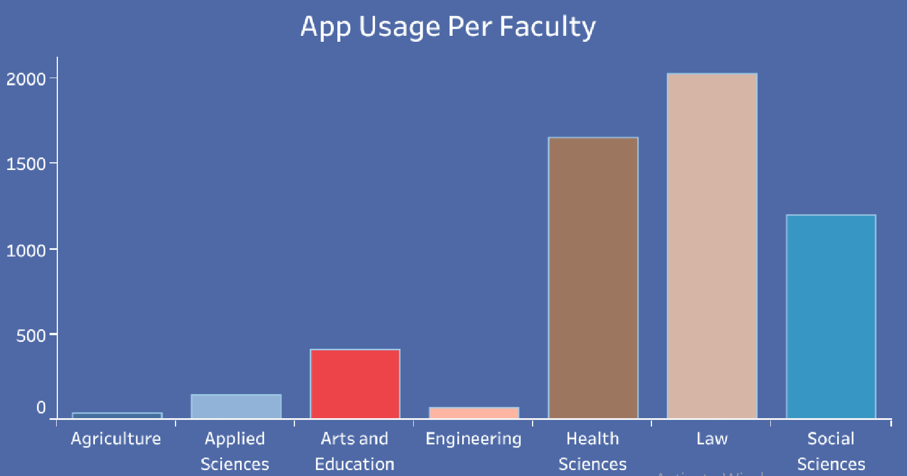
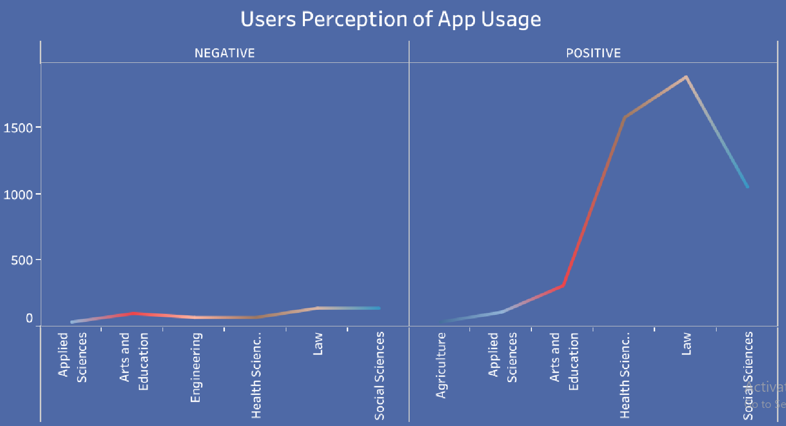

# WhatsApp_Marketing_Analysis

# Table of Contents
 - [Project Overview](#project-overview)
 - [Problem Statement](#problem-statement)
 - [Data Source](#data-source)
 - [Method of Analysis](#method-of-analysis)
 - [Tools](#tools)
 - [Graphs](#graphs)
 - [Key Observation](#key-observation)
 - [Summary of Findings](#summary-of-findings)
 - [Recommendations](#recommendations)
 - [Dashboard](#dashboard)
# Project Overview
This is a personal project whereby I conducted research on student entrepreneurs in Nigerian Universities and their usage of WhatsApp as a medium/tool for marketing their products and services. The need for this research study was as a result of the surge in students venturing into entrepreneurship on campuses in Nigeria due to increase in tuition fees.
# Problem Statement
How can one ascertain the effectiveness of WhatsApp as a marketing tool for student entrepreneurs?
# Data Source
I personally obtained data from undergraduate students of Benson Idahosa University in Benin City, Nigeria. A survey was carried out through the distribution of questionnaires with which answers were provided anonymously in order to ensure privacy protection. 
# Method of Analysis
* The populaton was too large to cover so a representative sample derived through the purposive random sampling technique was used to determine the respondents
* Questionnaires were distributed to students using a person to person approach
* The data gotten from the respondents were inputed into a table in Excel
* Sorted and ensured that the data was in a consistent format
* Cleaned and transformed the data for the purpose of analysis
* Converted it to a csv file and imported it into Tableau for visualization
# Tools
* Excel
* [Tableau](https://public.tableau.com/app/profile/joy.johnson5229/viz/WhatsAppUsagebyStudentEntrepreneurs/WHATSAPPUSAGEANALYSISDASHBOARD)
# Graphs
The following questions were answered and visualized as seen below:
1) How frequently is WhatsApp being used by entrepreneurs  across the various school faculties?

# Key Observation
WhatsApp social network is a viable marketing tool for student entrepreneurs
# Summary of Findings
* Majority of the student entrepreneurs had a positive perception towards the usage of WhatsApp as a marketing tool
* A higher majority affirmed its effectiveness for marketing their products
* There were few limitations to the usage of the app but it didn't have adverse effects on sales performance
# Recommendations
* The numerous benefits of modern-day technologies in bridging the gap between business users and their customers should be harnessed by student entrepreneurs to facilitate increase in sales performance
* Employ creativity in delivering messages for marketing in order to attract the attention of prospective customers
# Dashboard
The visualization I created in Tableau can be viewed [here](https://public.tableau.com/app/profile/joy.johnson5229/viz/WhatsAppUsagebyStudentEntrepreneurs/WHATSAPPUSAGEANALYSISDASHBOARD)
